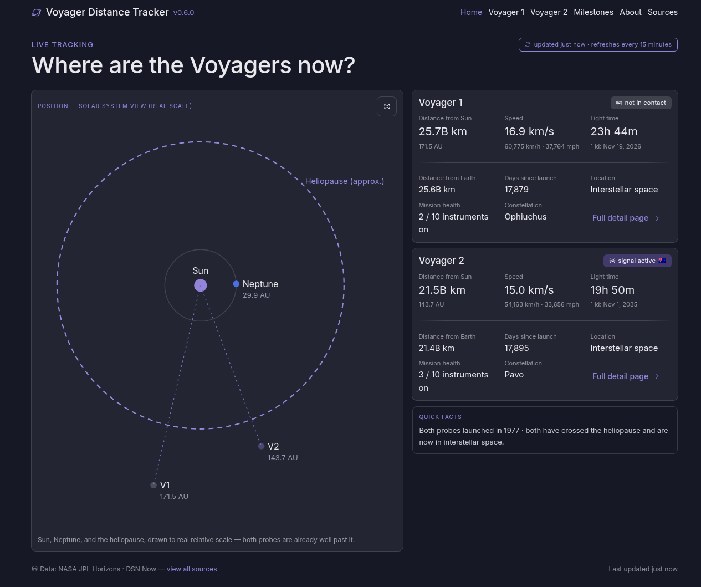

# Voyager Distance Tracker

[](CHANGELOG.md)
[](https://www.php.net/)
[](#architecture)
[](LICENSE)
[](https://github.com/LordOfTheSnow/voyager-tracker/pkgs/container/voyager-tracker)
[](https://github.com/LordOfTheSnow/voyager-tracker/actions/workflows/docker-publish.yml)

Live-ish distance/status tracker for Voyager 1 and Voyager 2, built for basic
shared PHP hosting. No database — see [Architecture](#architecture) below.

Not affiliated with or endorsed by NASA or JPL — just a hobby project built
on their public data.



## Features

- Live distance, speed, and light-time for both probes, sourced directly from
  JPL Horizons on every cache refresh.
- Live DSN contact/signal status from NASA's official DSN Now feed — a probe
  showing "not in contact" is expected dish-scheduling behavior, not an error.
  Dish-location flags are self-hosted SVGs rather than Unicode flag emoji, so
  they render consistently across browsers/OS instead of falling back to
  plain two-letter text on some platforms (e.g. Chrome on Windows).
- DSN link card shows each transmission's data rate and band, including the
  band's real deep-space frequency range (e.g. "X-band · 8,400–8,450 MHz")
  and a unit clarification for the data rate ("bps = bits per second").
- Home dashboard orrery drawn to true relative scale: Sun, Neptune, the
  heliopause boundary, and both probes, sized dynamically around whatever the
  live data actually needs.
- "Solar system — distances" modal with pan/zoom log-scale and true-linear-scale views
  of the whole solar system, including Mars, with a note on which direction
  the bodies orbit.
- Per-probe detail pages with precise distances, mission facts, constellation
  heading, and instrument status (illustrative, not live — see
  [Architecture](#architecture)).
- Milestones page: a filterable timeline of both missions' major events, from launch through
  planetary encounters and the heliopause crossings.
- About page with project background and a link to the source repo.
- Distances and speeds shown in multiple units (km, AU, mi, km/s, km/h, mph).
- A lightweight "fetching latest data" page for the rare visitor whose
  request lands right after the 15-minute cache expires, instead of a blank
  browser tab while the refresh completes.
- No database: a lazy, per-probe 15-minute file cache with stale-but-served
  fallback if a live refresh fails.
- No build step: Alpine.js via CDN, zero Node/webpack tooling.
- Deploys to plain SSH + `git pull` hosting, FTP-only shared hosting with no
  shell access, or Docker — see [Deploying](#deploying-docker).
- Optional Docker deployment with pre-built multi-architecture images
  (amd64/arm64), published automatically to GHCR on every release.

## Requirements

- PHP 8.1+ with `curl`, `simplexml`, and `json` extensions (all bundled by
  default on Arch/CachyOS's `php` package; on Debian-based hosts you may need
  `php-curl`/`php-xml` separately)
- [Composer](https://getcomposer.org/)

## Local development

```
composer install
composer start   # http://localhost:8000, built-in PHP dev server
composer test     # PHPUnit — fetch/cache/parsing logic only, no network calls
```

## Architecture

- **Data**: distance, speed, and one-way light time come from
  [JPL Horizons](https://ssd.jpl.nasa.gov/api/horizons.api) (official, no
  auth). Signal/contact status comes from NASA's official
  [DSN Now feed](https://eyes.nasa.gov/dsn/data/dsn.xml) (same XML the
  eyes.nasa.gov visualization uses). Instrument health is static — it's
  illustrative in the original design and there's no public telemetry-decode
  API to wire it to.
- **Caching**: no database. `App\Cache\FileCache` is a lazy TTL cache — one
  JSON file per probe in `var/cache/`, refreshed at most once every 15
  minutes (`config/app.php`). If a refresh fails, the last good cache is
  served with `stale: true` rather than breaking the page; a real error page
  only appears if there's no cache yet at all (e.g. first request ever).
- **Backend**: Slim Framework (routing) + Twig (templates — no PHP logic in
  views), autoloaded via Composer/PSR-4 (`App\` → `src/`).
- **Frontend**: Alpine.js via CDN for the "Solar system — distances" modal's open/close,
  scale toggle, and pan/zoom. No Node, no build step.

## Deploying (Docker)

Docker is entirely optional. The SSH and FTP paths below remain fully supported
and require no additional tooling.

> **Not meant for production traffic:** the image is `php:8.4-cli-alpine`
> running PHP's built-in development server (`php -S`), the same way
> `composer start` runs locally — chosen for a small image and a simple
> Dockerfile, not for concurrency or hardening. Fine for personal/low-traffic
> self-hosting; for anything production-grade, put a real web server
> (nginx/Apache) or a process manager like php-fpm in front of it.

```
# Pull and run the latest published image (amd64/arm64)
docker run -p 8000:8000 ghcr.io/lordofthesnow/voyager-tracker:latest

# Or build locally instead of pulling
docker build -t voyager-tracker .
docker run -p 8000:8000 voyager-tracker

# Or use Docker Compose (builds, maps port 8000, and lets you override the
# cache TTL / HTTP timeout via a .env file or exported shell vars)
docker compose up
```

The container always listens on the port given by the `PORT` env var (default
`8000`) — use Docker's `-p` flag to map any host port to it (e.g.
`-p 9090:8000`), keeping the container-side number in `-p`/`ports:` matched to
whatever you set `PORT` to. `CACHE_TTL_SECONDS` and `HTTP_TIMEOUT_SECONDS` are
also optional env vars, overriding the same-named values in `config/app.php`.
`var/cache/` is intentionally not persisted across restarts — see
[Architecture](#architecture) for why a cold cache is harmless here.

Images are built and published automatically by
[`.github/workflows/docker-publish.yml`](.github/workflows/docker-publish.yml)
whenever [`.github/workflows/release.yml`](.github/workflows/release.yml) cuts
a new tagged release (i.e. whenever `composer.json`'s `version` changes on
`main`) — see [CHANGELOG.md](CHANGELOG.md) for what's in each release.

## Deploying (SSH, no root, cron optional but not required)

```
ssh you@host
cd /path/to/app
git clone <repo> .          # first time
# or: git pull               # subsequent deploys
composer install --no-dev --optimize-autoloader
```

Point the host's document root at `public/`. Make sure `var/cache/` is
writable by the PHP process (`FileCache` creates it automatically if
missing, but the parent `var/` directory must be writable).

No cron job is required — the cache refreshes lazily on request — but one
could be added later to pre-warm the cache if desired.

## Updating

To pull in new code and dependencies on an existing SSH deployment:

```
ssh you@host
cd /path/to/app
git pull
composer install --no-dev --optimize-autoloader
```

`composer install` reads the committed `composer.lock` and installs exactly
the dependency versions that were tested locally — unlike `composer update`,
it never changes what version of anything gets installed. No cache clear or
process restart is needed afterward: `var/cache/` entries just expire on
their own 15-minute TTL (`config/app.php`) and get refreshed on the next
request.

To actually bump a dependency to a newer version, do that locally first, not
on the server:

```
composer update vendor/package     # or just `composer update` for everything
composer test                      # confirm nothing broke
git add composer.json composer.lock
git commit -m "Update vendor/package"
git push
```

Then deploy as above — the server's `composer install` will pick up the new
`composer.lock`. If you added a new class under `src/`, regenerate the
autoloader before committing:

```
composer dump-autoload
```

For the FTP-only setup below, "updating" means repeating the whole
`composer install --no-dev --optimize-autoloader` + upload-`vendor/` process
described there, since there's no `git pull` on the server to do the update
in place.

## Deploying (FTP-only shared hosting, no shell access)

Some basic shared-hosting plans only offer FTP and a fixed document root
(`public_html/` or similar) that can't be repointed at a subfolder like
`public/`. This app still works there, with two adjustments:

1. **Get `vendor/` into the files you upload.** `vendor/` is gitignored and
   not part of a plain repo download/zip — it has to be assembled once and
   shipped as files. Easiest: grab the pre-built zip from the
   [Releases page](https://github.com/LordOfTheSnow/voyager-tracker/releases)
   (built by `.github/workflows/ftp-release-zip.yml` on every tagged
   version — `vendor/` is already installed inside it). Otherwise, run
   `composer install --no-dev --optimize-autoloader` somewhere you do have
   PHP + Composer (locally, or a throwaway VM/container) and upload the
   resulting `vendor/` directory over FTP along with everything else.
2. **Upload the whole repo into the fixed document root as-is** (i.e. this
   `index.php` and `.htaccess` end up at the same level as `public/`,
   `src/`, `vendor/`, etc.) — do *not* move `public/`'s contents up a
   level. The root `index.php` and `.htaccess` are a fallback front
   controller for exactly this case: `.htaccess` serves `/assets/*` out of
   `public/assets/` and routes every other request through the root
   `index.php`, which just delegates to `public/index.php`. Everything
   else (`vendor/`, `src/`, `config/`, `tests/`) stays unreachable from the
   web — Slim only ever exposes the routes it defines.

This requires `mod_rewrite` to be enabled and `.htaccess` overrides allowed
(true on virtually all cPanel-style shared hosting). If your host *can*
set the document root to `public/`, prefer that — it's the setup actually
exercised above — and you can ignore the root `index.php`/`.htaccess`
entirely (`public/.htaccess` alone handles routing there).
